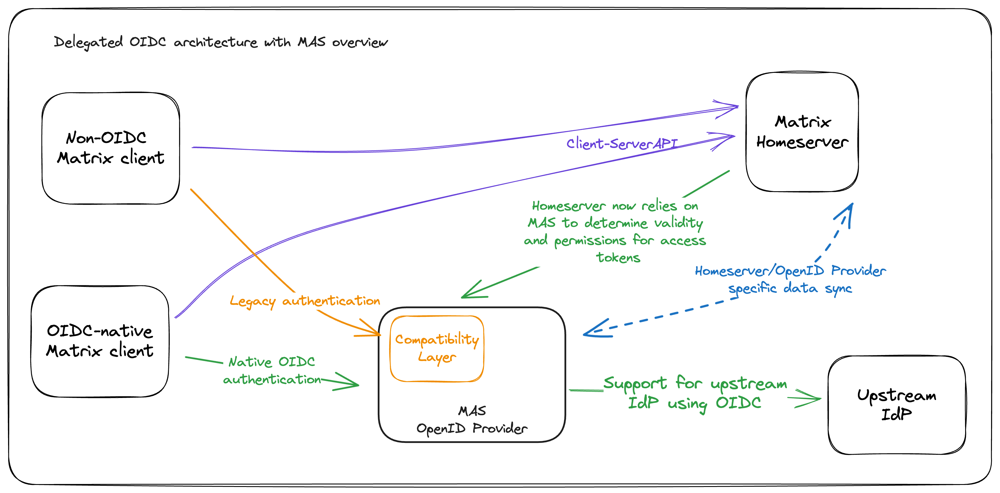

# OAuth2.0 + OpenID Connect Provider for Matrix Homeservers

MAS (Matrix Authentication Service) is an OAuth 2.0 and OpenID Provider server for Matrix.

It has been created to support the migration of Matrix to an OpenID Connect (OIDC) based authentication layer as per [MSC3861](https://github.com/matrix-org/matrix-doc/pull/3861).

See the [Documentation](https://matrix-org.github.io/matrix-authentication-service/index.html) for information on installation and use.

You can learn more about Matrix and OIDC at [areweoidcyet.com](https://areweoidcyet.com/).

## Features

- Supported homeservers
  - ✅ Synapse
- Authentication methods:
  - ✅ Upstream OIDC
  - 🚧 Local password
- Migration support
  - ✅ Compatibility layer for legacy Matrix authentication
  - 🚧 Advisor on migration readiness
  - 🚧 Import users from Synapse
  - 🚧 Import of external subject IDs from upstream identity providers

## Upstream Identity Providers

MAS is known to work with the following upstream IdPs via OIDC:

- [Keycloak](https://www.keycloak.org/)
- [Dex](https://dexidp.io/)
- [Google](https://developers.google.com/identity/openid-connect/openid-connect)
